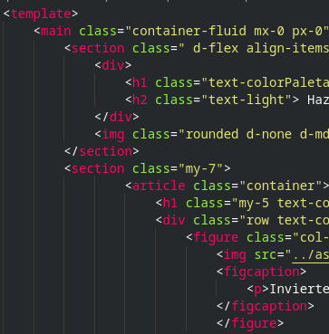
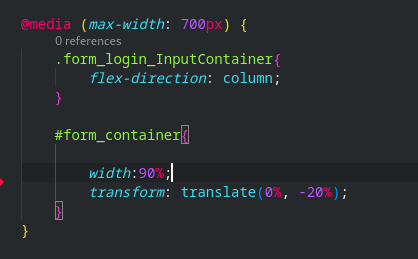
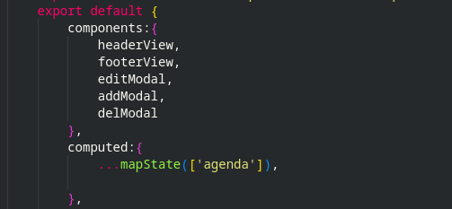
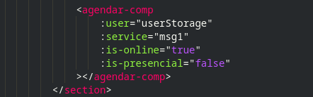

# solar-calc
Este es el archivo README del portafolio del proyecto solar-calc para optar por la insignia de talento digital.

## introducción
Este proyecto es llamado solar-calc, abreviatura de calculadora solar, su funcion es generar una plataforma
que permita a usuarios previamente registrados conocer aspectos importantes a la hora de montar un proyecto
fotovoltaico

## Requerimientos del usuario
Desarrollar una plataforma que le permita al usuario, conocer datos fundamentales a la hora de montar un proyecto
fotovoltaico como lo son los paneles solares.

## Requerimientos del sistema
## Requerimientos del sistema
-El usuario sera capaz de registrarse en la plataforma (correo y contraseña).
-El usuario sera capaz de logearse con su cuenta de usuario.
-El usuario al iniciar sesion tendra la opción de iniciar una calculadora interactiva en la que podra calcular:
    -.Precio aproximado de los paneles solares.
    -.Espacio necesario para la instalacion de paneles solares.
    -.Cantidad de paneles solares necesarios para suplir las necesidades del usuario.
    -.Consumo total anual de el/los participantes.
-El usuario podra optar por regitrar una asesoria la cual puede ser presencial u online.
-El sistema tendra una opcion especial para una cuenta de administrador el cual tendra acceso a:
    -.Agendar una asesoria nueva.
    -.Eliminar una asesoria agendada.
    -.Modificar una asesoria agendada.
-La opcion de Admninistracion solo debe estar visible para la cuenta de administrador si un usuario intenta acceder
 esta accion le sera denegada.
 -Creacion de base de datos nonSQL para guardar las agendas. 

## 1 - Experiencia de uso
EL Proyecto se encuentra sin errores de ejecucion en consola, como se podra observar en el inspector, no existen problemas de navegacion, la presentacion y aspecto del sitio quedara a criterio del evaluador.

## 2 - Completitud del entregable
Entregable posee todas las funcionalidades descritas en los requerimientos del sistema.
los modulos principales son: Login/pagina de administracion/Calculadora/Agendar asesoria.
de forma adicional se presento la funcionalidad de enviar un correo al usuario cuando este agenda una asesoria.

## 3 - Utilización de tags html
En todos los componentes (que no son modales de bootstrap) se utiliza tags html con semantica acorde al standar HTML5 como: main/article/section/figcaption/div/img/ul/li/nav/header/footer.<br/>
 <br/>
[src/components/BodyHomeComp.vue](src/components/BodyHomeComp.vue)-- Linea 1 --

## 4 - Responsividad
El proyecto es responsivo en su totalidad, se adapta a todo tipo de dispositivos, existe el uso de 
media queries de css en la vista de LoginView.vue y comportamiento responsivo con bootstrap con la utilizacion de breakpoints, esto se puede visualizar en el componente BodyAboutUs linea 13-28-43.<br/>
<br/> 
[src/views/BodyHomeComp.vue](src/views/LoginView.vue)

## 5-Utilizacion de un framework de css
Se utilizo bootstrap en la gran mayoria del proyecto visualizado en componentes como el siguiente  
<br/>
[src/components/calcView1.vue](src/views/calc1View.vue) --linea 9--

## 6 -Código mantenible mediante componentes
Estructura vue CLI mediante componentes y SPA  
<br/>
[src/views/AdmAgenda.vue](src/views/AdmAgenda.vue) --linea 51/56--

## 7- Utilizacion de los metodos del ciclo de vida de un componente
Se implemento el uso de ciclo de vida mounted/created en algunos de los componentes
<br/>
[src/views/LoginView.vue](src/views/LoginView.vue) --linea 173--

## 8-Comunicacion entre componentes
Se utilizo tanto emits como props en alguno de los componentes
<br/>
[src/components/BodyService.vue](src/components/BodyService.vue) --linea 57--<br/>
<br/>
[src/components/editionModalComp.vue](src/components/edition.vueModalComp) --linea 92--

## Project setup
```
npm install
```

### Compiles and hot-reloads for development
```
npm run serve
```

### Compiles and minifies for production
```
npm run build
```

### Lints and fixes files
```
npm run lint
```

### Customize configuration
See [Configuration Reference](https://cli.vuejs.org/config/).
