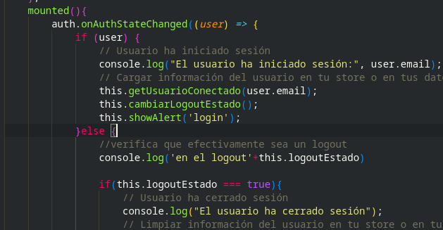
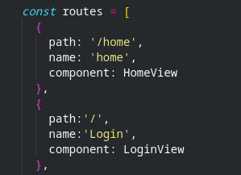
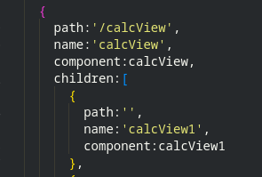
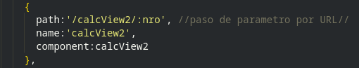
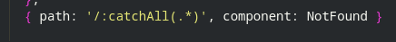
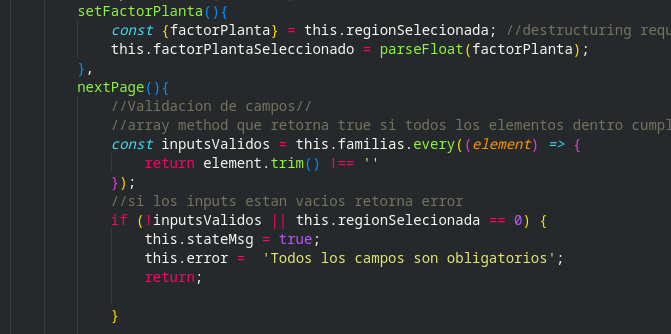
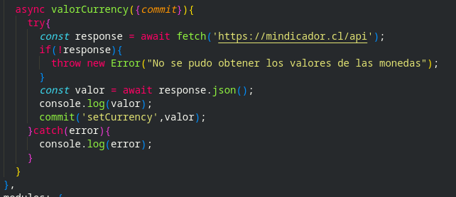
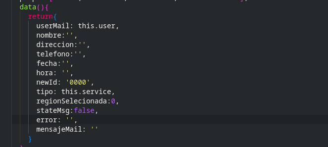
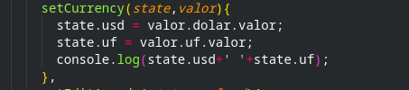

# solar-calc
Este es el archivo README del portafolio del proyecto solar-calc para optar por la insignia de talento digital.

## introducción
Este proyecto es llamado solar-calc, abreviatura de calculadora solar, su función es generar una plataforma que permita a usuarios previamente registrados conocer aspectos importantes a la hora de montar un proyecto fotovoltaico.

## Requerimientos del usuario
Desarrollar una plataforma que le permita al usuario, conocer datos fundamentales a la hora de montar un proyecto fotovoltaico como lo son los paneles solares.

## Requerimientos del sistema
    
    • El usuario será capaz de registrarse en la plataforma (correo y contraseña).
    • El usuario podrá iniciar sesión con su cuenta de usuario.
    • El usuario al iniciar sesión tendrá la opción de iniciar una calculadora interactiva en la que podrá calcular:
        ◦ Precio aproximado de los paneles solares.
        ◦ Espacio necesario para la instalación de paneles solares.
        ◦ Cantidad de paneles solares necesarios para suplir las necesidades del usuario.
        ◦ Consumo total anual del/los participantes.
    • El usuario podrá optar por registrar una asesoría la cual puede ser presencial u online.
    • El sistema tendrá una opción especial para una cuenta de administrador, el cual tendrá acceso a:
        ◦ Agendar una asesoría nueva.
        ◦ Eliminar una asesoría agendada.
        ◦ Modificar una asesoría agendada.
    • La opción de Administración solo debe estar visible para la cuenta de administrador, si un usuario intenta acceder esta acción le será denegada.
    • Creación de base de datos non SQL para guardar las agendas.
    
## 1- Experiencia de uso
El Proyecto se encuentra sin errores de ejecución en consola, como se podrá observar en el inspector, no existen problemas de navegación, la presentación y aspecto del sitio quedara a criterio del evaluador.

## 2-Completitud del entregable
Entregable posee todas las funcionalidades descritas en los requerimientos del sistema. Los módulos principales son: Login/página de administración/Calculadora/Agendar asesoría. De forma adicional se presentó la funcionalidad de enviar un correo al usuario cuando este agenda una asesoría.

## 3 - Utilización de tags html
En todos los componentes (que no son modales de bootstrap) se utiliza tags HTML con semántica acorde al estándar HTML5 como: main/article/section/figcaption/div/img<br/>
 <br/>
[src/components/BodyHomeComp.vue](src/components/BodyHomeComp.vue)-- Linea 1 --

## 4-Responsividad
El proyecto es responsivo en su totalidad, se adapta a todo tipo de dispositivos, existe el uso de media queries de css en la vista de LoginView.vue y comportamiento responsivo con bootstrap con la utilización de breakpoints, esto se puede visualizar en el componente BodyAboutUs.<br/>
<br/> 
[src/views/BodyHomeComp.vue](src/views/LoginView.vue) –-linea 13-28-43--

## 5-Utilizacion de un framework de css
Se utilizó bootstrap en la gran mayoría del proyecto visualizado en componentes como el siguiente.<br/>  
<br/>
[src/components/calcView1.vue](src/views/calc1View.vue) --linea 9--

## 6-Código mantenible mediante componentes
Estructura vue CLI mediante componentes y SPA.<br/> 
<br/>
[src/views/AdmAgenda.vue](src/views/AdmAgenda.vue) --linea 51/56--

## 7-Utilización de los métodos del ciclo de vida de un componente
Se implementó el uso de ciclo de vida mounted/created en algunos de los componentes.<br/>
<br/>
[src/views/LoginView.vue](src/views/LoginView.vue) --linea 173--

## 8-Comunicación entre componentes
Se utilizó tanto emits como props en alguno de los componentes.<br/>
<br/>
[src/components/BodyService.vue](src/components/BodyService.vue) --linea 57--<br/>
<br/>
[src/components/editionModalComp.vue](src/components/edition.vueModalComp) --linea 92--

## 9-Utilización de buenas prácticas en la definición de rutas
Nombres descriptivos para las rutas<br/>
<br/>
[src/router/index.js](src/router/index.js) --linea 17/n--<br/>
Estructura jerárquica</br> 
<br/>
[src/router/index.js](src/router/index.js) --linea 72--<br/>
Parámetro por URL</br>  
<br/>
[src/router/index.js](src/router/index.js) --linea 79--<br/>
Rutas por defecto</br> 
<br/>
[src/router/index.js](src/router/index.js) --linea 95--<br/>

## 10-Utilización de sintaxis básica JavaScript
Utilización de declaración de variables y métodos de formateo en javascript.<br/>
<br/>
[src/components/BodyService.vue](src/components/BodyService.vue) --linea 115/126--<br/>

## 11- Utilización de Javascript es6/7 para resolver un problema
Se utiliza es6 en el proyecto en la gran mayoría de los componentes.<br/>
<br/>
[src/components/calcView2.vue](src/components/calcView2.vue) --linea 72/88--<br/>
 
## 12- Consumo API
Se usa el consumo de una API que proporciona los valores de indicadores económicos se manejan errores en cualquier caso.<br/>
<br/>
[src/store/index.js](src/store/index.js) --linea 195--<br/>

## 13-Estados internos de los componentes web
Utilización de estado de objeto data dentro del componente(error/stateMsg).<br/>
<br/>
[src/components/AgendarComp.vue](src/components/AgendarComp.vue) --linea 89/90--<br/>
<br/>
[src/components/AgendarComp.vue](src/components/AgendarComp.vue) --linea 58/60--<br/>

## 14- Maneja el estado de la aplicación con Vuex
Manejo de estados y consumo de servicio REST por medio de estructura de Vuex action.</br>
<br/>
[src/store/index.js](src/store/index.js) --linea 195--<br/>
<br/>
[src/store/index.js](src/store/index.js) --linea 80/84--<br/>

## Project setup
```
npm install
```

### Compiles and hot-reloads for development
```
npm run serve
```

### Compiles and minifies for production
```
npm run build
```

### Lints and fixes files
```
npm run lint
```

### Customize configuration
See [Configuration Reference](https://cli.vuejs.org/config/).
